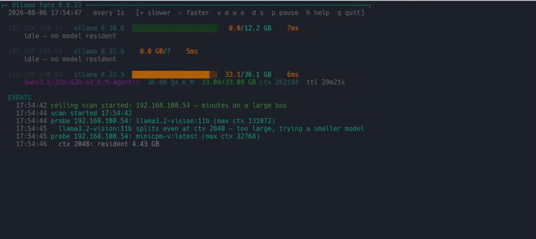

# ollamaFarm

**A terminal dashboard for a farm of [Ollama](https://ollama.com) servers.** Finds them
on your network, shows what every one of them is doing, and keeps up at 1 Hz — in the
spirit of `htop` and `btop`, for LLM boxes instead of CPUs.

[](https://www.gnu.org/software/bash/)
[](LICENSE)
[](https://github.com/marcelpetrick/ollamaFarm/actions/workflows/quality.yml)

One file, no runtime, no daemon, no agent on the servers: `curl` + `jq` + `awk` and a
terminal.

[](media/showcase.webm)

<sub>Click the preview for the full-quality recording
([`media/showcase.webm`](media/showcase.webm), VP9, 38 s).</sub>


**Author:** Marcel Petrick &lt;mail@marcelpetrick.it&gt;
**License:** GPLv3 or later — see [LICENSE](LICENSE).
**Note:** this project was generated with AI assistance.

---

## Features

- **Finds your servers.** Scans the local `/24` for anything answering the Ollama API,
  caches what it finds, and re-scans on a keypress. No config needed to start.
- **Shows every host at a glance** — version, VRAM in use with a bar, response latency,
  and each resident model with its size, quantisation, context and keep-alive countdown.
- **Works out how much VRAM a host really has**, which the API does not tell you: it
  learns from what it observes, and can measure an idle host by loading a model and
  expanding until it spills. Automatic, or on demand with `s` / `--probe-vram`.
- **A live event log** — models loading, expiring, being displaced, hosts dropping off
  the network. State changes you would otherwise have to catch in the act.
- **Three colour themes**, switchable while running: `dark` for any terminal, `vivid`
  for a loud 256-colour look, `light` for a white background.
- **Proper TUI controls** — `+`/`-` refresh rate, pause, per-section toggles, a help
  overlay, all persisted between sessions.
- **Read-only and credential-free.** Two `GET`s per host per frame. It never creates or
  deletes a model, and needs no account on the machines it watches — which is what makes
  it safe to point at a colleague's server.
- **Flags configurations that quietly cost you throughput** — see
  [what it watches](#what-it-watches).

---

## At runtime

Real output, three servers, 104-column terminal:

```
┌─ Ollama farm 0.0.27 ───────────────────────────────────────────────────────────────────────┐
  2026-08-06 15:36:49   every 1s   [+ slower  - faster  v m w e  d  p pause  h help  q quit]

  192.168.100.37   ollama 0.30.6  ██████████████░░░░░░░░   8.0/12.2 GB    6ms
      qwen3.5:9b-ctx80k                9.7B Q4_K_M   8.01/8.01  GB ctx 81920   ttl 16m5s
        ↳ presence_penalty=1.5 (~35% slower — bake 0);

  192.168.100.67   ollama 0.32.5  ████████████████████░░  33.1/36.1 GB    6ms
      qwen3.6:35b-a3b-q4_K_M-agentic  36.0B Q4_K_M  33.09/33.09 GB ctx 262144  ttl 1h44m

  EVENTS
    15:36:49 loaded qwen3.5:9b-ctx80k on 192.168.100.37
```

Each host line is `address · version · VRAM bar · used/ceiling · latency`, followed by
one line per resident model. The `↳` line under a model is a configuration warning; the
`+` after a ceiling means "at least this much" rather than a known total.

<details>
<summary>The same view with things going wrong (fabricated, to show the alarm states together)</summary>

```
┌─ Ollama farm 0.0.27 ──────────────────────────────────────────────────   PAUSED — press p to resume ┐
  2026-08-13 03:04:59   every 5s   [+ slower  - faster  v m w e  d  p pause  h help  q quit]

  192.168.100.13   ollama 0.32.5  ██████████████████████  35.9/36.1 GB  1840ms
      hoarder-70b:q8_0                69.9B Q8_0    31.40/35.80 GB ctx 4096    ttl 12s   ⚠ SPLIT→CPU (5.3x slower)
        ↳ presence_penalty=1.5 (~35% slower — bake 0); no baked num_ctx (16k cap via /v1/messages, tool calls die past it)
      tiny-yolk:0.5b                   0.5B Q4_0     0.41/0.41  GB ctx 2048    ttl 4m2s

  192.168.100.99   ollama 0.30.6  ░░░░░░░░░░░░░░░░░░░░░░   0.0 GB/?      9ms
      idle — no model resident

  192.168.100.37   ollama 0.30.6  UNREACHABLE (USB ethernet adapter up?)

  EVENTS
    03:04:31 loaded hoarder-70b:q8_0 on 192.168.100.13
    03:04:44 tiny-yolk:0.5b vanished on 192.168.100.13, 238s ttl left — suspected eviction, watching
    03:04:52 EVICTED tiny-yolk:0.5b on 192.168.100.13 → hoarder-70b:q8_0 after 8s (~70 s reload penalty)
    03:04:58 192.168.100.37 went unreachable (was holding: qwen3.5:9b-ctx80k)
```

Everything wrong with that box, top to bottom: the VRAM bar is red at 99%; the 70B is
**split to CPU** (31.40 GB resident of 35.80); it has **no baked `num_ctx`** so it is
capped at 16k and its tool calls will silently stop; `presence_penalty` is on; its
`ttl` is yellow because it expires in 12 s; latency is 1840 ms because the box is
thrashing; a small model was **evicted** to make room; and another host dropped off the
network. `.99` was found by discovery, so its ceiling is honestly `?` rather than
guessed.

</details>

---

## Keys

| key | effect |
|---|---|
| `-` / `+` | refresh **faster** / **slower** — steps the ladder `0.25 0.5 1 2 3 5 10 30` s |
| `p` | pause / resume (a paused frame polls nothing at all) |
| `v` | VRAM bars |
| `m` | per-model detail |
| `w` | the `↳` config warnings |
| `e` | event log |
| `d` | re-run host discovery |
| `s` | re-scan idle hosts for their VRAM ceiling |
| `t` | cycle colour theme (`dark` → `vivid` → `light`) |
| `h` or `?` | help overlay |
| `q` | quit |

`+` makes the interval *number* bigger, hence slower — the same direction as btop. Any
section you switch off is named in the header (`hidden: models:off(m)`), so a toggle
saved in an earlier session cannot leave you staring at a screen that looks broken.

---

## Command line

```shell
./ollamaFarm.sh                    # default hosts, 1 s
./ollamaFarm.sh -n 5               # 5 s (snapped to the nearest ladder rung)
./ollamaFarm.sh -H 10.0.0.5,10.0.0.6
./ollamaFarm.sh -p 11435           # non-default port
./ollamaFarm.sh -D                 # scan for hosts at startup
./ollamaFarm.sh --probe-vram HOST  # measure a VRAM ceiling now, then exit
./ollamaFarm.sh --no-auto-scan     # do not bootstrap unknown ceilings
./ollamaFarm.sh --theme light      # dark (default) | vivid | light
./ollamaFarm.sh --no-color         # plain; NO_COLOR is honoured too
./ollamaFarm.sh --version
./ollamaFarm.sh --help
```

Requires `curl`, `jq`, `awk`. Checked at startup.

---

## Host discovery

**Hardcoded defaults; scanning is opt-in.** Three sources, highest precedence first:

1. `-H a,b,c` — pins the list; never overridden
2. `$XDG_CONFIG_HOME/ollamafarm/hosts` — the cached result of a previous scan
3. the built-in defaults

A scan runs on `-D` or the `d` key. It derives the `/24` from the hosts it already
knows, probes `/api/version` on `.1`–`.254` **64 at a time** with a 0.6 s timeout, and
caches what answered — both servers found well inside one refresh interval.

Two deliberate limits: it only scans `/24`s **derived from hosts it already knows**, so
it will not find a server on an unrelated subnet (blind-scanning arbitrary ranges is not
something a monitor should do unasked); and whether an address is public or private is
irrelevant, only its numeric range matters. A loopback-only server is therefore never
auto-discovered — use `-H 127.0.0.1`.

To give a host a known VRAM ceiling, add it to `VRAM_TOTAL` near the top of the script:

```bash
declare -A VRAM_TOTAL=( [192.168.100.37]=12.2 [192.168.100.67]=36.1 )
```

---

## Themes

Three, cycled with `t` or chosen with `--theme`:

| theme | for | palette |
|---|---|---|
| `dark` *(default)* | any terminal, including a plain tty | ANSI 8-colour, so it inherits **your** palette |
| `vivid` | dark background, 256-colour | loud: cyan structure, orange figures, orchid model names |
| `light` | light background | dark ends of each hue — forest green, brick red, burnt orange |

`vivid` paints seven distinct hues in a single frame where `dark` uses five, two of
which are only bold and dim. The difference is that it colours **secondary** text —
field labels, units, the version, latency — instead of dimming it.

Colour is assigned by role, never picked at the call site, so a theme repaints meanings
but cannot repurpose them: **green is healthy, yellow is about to change, red is costing
you throughput right now** — in every theme.

<details>
<summary>The slots a theme paints, and two notes on the choices</summary>

| slot | role |
|---|---|
| `C_GRN` | healthy — resident, fully in VRAM |
| `C_YEL` | about to change — expiring `ttl`, elevated latency, hidden sections |
| `C_RED` | costing you throughput **now** — split to CPU, evicted, unreachable |
| `C_FIG` | figures — VRAM totals, latency |
| `C_MODEL` | model names |
| `C_HDR` | structure — the header rule, `EVENTS`, `KEYS` |
| `C_HOST` | host identity |
| `C_LBL` | labels and units — `ctx`, `ttl`, quantisation, version |
| `C_DIM` | genuinely secondary text |

- `light` avoids yellow entirely — it is unreadable on white — and uses dark amber. It
  also sets an explicit grey for secondary text, because the ANSI *dim attribute*
  renders as barely-there on a light background in several terminals.
- `dark` deliberately stays 8-colour rather than looking nicer. It is the fallback that
  has to work over serial, in a VM console, and under `TERM=linux`.

</details>

`--no-color` and `NO_COLOR` bypass theming entirely and emit no escape sequences.

---

## VRAM ceilings

A bar needs a denominator, and the Ollama API does not expose one — there is no
total-VRAM field on any endpoint. Three sources are used instead:

| shown as | source | meaning |
|---|---|---|
| `33.1/36.1 GB` | the `VRAM_TOTAL` table | a figure someone measured and stands behind |
| `0.0/7.77+ GB` | **probed** or **learned** | *at least* this much fits — a lower bound |
| `0.0 GB/?` | nothing known | no bar drawn, rather than a guessed one |

The **`+` is load-bearing.** A bar that silently meant either "this is the capacity" or
"it is at least this much" would be worse than no bar.

**Learned** costs nothing: `/api/ps` is already polled every frame, so the largest total
ever seen *fully resident* is recorded. **Scanning** gets a tighter figure by loading a
model at escalating `num_ctx` until it splits — which is also how a host with nothing
resident gets bootstrapped, since passive observation cannot start from an idle server:

```shell
# automatic on startup, for any idle host whose ceiling is unknown or only learned
./ollamaFarm.sh
./ollamaFarm.sh --no-auto-scan          # opt out

# press s at any time to re-scan; or, in the foreground with no TUI:
./ollamaFarm.sh --probe-vram            # every known host
./ollamaFarm.sh --probe-vram 10.0.0.5   # one host
```

It is safe on a shared server: **idle hosts only** — anything resident and the host is
skipped, loudly, naming what it would have had to evict; `keep_alive: 0` on every load,
so nothing is left behind; and it runs **detached**, so the display keeps refreshing
while progress appears in the event log. A second scan while one runs is refused.

Durations: **~15–60 s** for a small box, **several minutes** for a large one — reach
needs a large model, and a 33 GB model alone takes ~70 s per load.

<details>
<summary><code>--probe-vram</code> in detail: real output, exit codes, scripting</summary>

```console
$ ./ollamaFarm.sh --probe-vram 192.168.100.54
scan started 17:57:49
probe 192.168.100.54: llama3.2-vision:11b (max ctx 131072)
  llama3.2-vision:11b splits even at ctx 2048 — too large, trying a smaller model
probe 192.168.100.54: minicpm-v:latest (max ctx 32768)
  minicpm-v:latest splits even at ctx 2048 — too large, trying a smaller model
probe 192.168.100.54: qwen3.5:4b-ctx54k (max ctx 262144)
  ctx 2048: resident 3.06 GB
  ctx 132096: resident 7.22 GB
  ctx 197120: SPLIT — ceiling is below this
  ctx 164608: SPLIT — ceiling is below this
  ctx 148352: resident 7.77 GB
  ctx 156480: SPLIT — ceiling is below this
  ctx 152416: SPLIT — ceiling is below this
RESULT 192.168.100.54 7.77
scan finished 17:58:57
```

Note the two fallbacks: the largest model, and then the second largest, split even at
the minimum context, so the scan moved on to one that fits. That is the reach problem —
it wants the biggest model that still fits, and finds it by trying.

**The result is used, not just printed.** It is written to
`$XDG_CONFIG_HOME/ollamafarm/vram` as `source=probed`, and every later run draws its bar
against it:

```
192.168.100.54   ollama 0.32.6  ░░░░░░░░░░░░░░░░░░░░░░   0.0/7.77+ GB    7ms
```

| exit code | meaning |
|---|---|
| `0` | a ceiling was established and stored |
| `1` | none could be — every host busy, or no model fits |
| `2` | bad arguments |

```shell
./ollamaFarm.sh --probe-vram 10.0.0.5 || echo "host busy, try later"
```

A probed value is never overwritten by a smaller passive observation.

</details>

Full investigation of what the API can and cannot tell you:
[docs/vram-discovery.md](docs/vram-discovery.md).

---

## Configuration

Interval, toggles and theme persist to `$XDG_CONFIG_HOME/ollamafarm/config`
(`~/.config/ollamafarm/config`):

```
idx=2            # index into the interval ladder; 2 = 1 s
show_bars=1
show_models=1
show_warn=1
show_events=1
theme=dark
```

Only these keys are read back, and each is validated on load, so a corrupt or
hand-edited file cannot break a run. Delete the file to return to defaults. The
discovered host list and learned ceilings live beside it in `hosts` and `vram`.

---

## What it watches

Beyond showing state, it flags four configurations that cost real throughput and report
no error anywhere:

| flagged | detected by | measured cost |
|---|---|---|
| **Eviction thrash** — a second model displaces the resident one | diffing the model set between polls | **~70 s** reload |
| **Split placement** — part of the model sits in system RAM | `size_vram < size` | **5.3×** slower |
| **No baked `num_ctx`** | `/api/show` | **16k** context cap; tool calling then stops silently |
| **`presence_penalty != 0`** | `/api/show` | **~35%** of throughput |

The last two are invisible to `ollama ps`, and the first cannot be seen in a snapshot of
any kind — only a diff across time reveals it.

<details>
<summary>Where those numbers come from</summary>

Measured, not estimated, across two servers — a dual-GPU box with 36.1 GB of usable
VRAM (Ollama 0.32.5) and a 12.2 GB box (0.30.6) — over 13 model configurations of the
qwen3.5/3.6 family.

| claim | how it was established |
|---|---|
| eviction costs **~70 s** | loaded a 9 GB model beside a resident 33 GB MoE; the MoE was unloaded, and the next request took 70.2 s end to end |
| split placement costs **5.3×** | same weights and quantisation, only `num_ctx` changed: 29.6 tok/s fully resident vs 5.6 tok/s with 4.58 GB of 36.65 GB in system RAM |
| `presence_penalty` costs **~35%** | isolated at fixed weights, context and VRAM: 84.4 tok/s at the vendor default of 1.5, 129.5 tok/s at 0 |
| bare tags cap at **16384** | sent 4k/16k/32k/50k-token prompts through `/v1/messages`; processed counts pinned at 16386 past the cap and `tool_use` blocks stopped appearing, with no error at any layer |

Two caveats, because they bound how far the numbers travel: they are **specific to that
hardware and those models** — the `~70 s` reload is what a 33 GB MoE costs, and the
eviction message quotes the figure it was calibrated against rather than computing a
per-model estimate; and the `num_ctx`-overflow behaviour behind the 16k finding is
**version dependent** — 0.32.5 truncates an overflowing prompt to `num_ctx/2` while
0.30.6 fills the window normally, so treat a newer Ollama as something to re-measure.

The full write-up lives with the original benchmarking work in
[codingWithGPT](https://github.com/marcelpetrick/codingWithGPT) under
`ollamaClaudeCode_v1/`. This repository carries only the monitor.

</details>

---

## Notes and limits

<details>
<summary>Load on a shared server, what it cannot show, known limits</summary>

**Load.** Two `GET`s per host per frame (`/api/version`, `/api/ps`), both read-only.
`/api/show` is fetched once per (host, model) and cached. Nothing is polled while
paused. At 1 Hz two hosts are about 170k requests a day, which is worth knowing before
leaving it running overnight; `+` dials the interval back to 30 s.

**GPU temperature, utilisation, fan and power are not shown.** The Ollama API does not
expose them — they live in `nvidia-smi` on the server, which would mean SSH access to
every host. That is deliberately out of scope: needing no credentials is what makes this
safe to point at someone else's machine. An earlier version shipped an `--ssh` flag that
was permanently inert because the key access never materialised; a feature that never
works is worse than an absent one, so it was removed.

**Whether a model is actively generating** is not exposed either. `/api/ps` reports
residency, not activity. Latency is the closest proxy — a busy host answers `/api/ps`
more slowly, which is why it turns yellow above 400 ms and red above 1500 ms.

**Eviction confirmation** uses a 150 s window; a displacement whose replacement takes
longer to become resident stays labelled "suspected".

**Frames are clipped to the terminal height** rather than scrolled. Enlarge the window,
or press `m` / `e`, if you see `…frame clipped to terminal height`.

</details>

---

## Development

```shell
./localPipeline.sh          # syntax, shellcheck, docs and smoke checks + summary
./localPipeline.sh --help
```

The pipeline is self-contained and needs no network for its mandatory stages; the live
smoke test against a real server is optional and skipped when no host answers. Every
push runs the mandatory stages in GitHub Actions; the Quality badge at the top links to
the latest result for `master`.

Contributor and agent guidance, including the traps this codebase has already been
bitten by: [docs/agents.md](docs/agents.md).

---

## Versioning

Semantic versioning, patch bumped on every commit. `VERSION` near the top of
`ollamaFarm.sh` is the single source of truth; it is rendered in the header
(`┌─ Ollama farm 0.0.27 ──…──┐`) so a screenshot or a pasted frame identifies its build,
and `--version` prints it.

**No git tags are used.** The version in the script is the only marker, so there is
exactly one place to look and nothing that can disagree with it.

While the major version is `0` the interface is not stable.

---

## License

GPLv3. See [LICENSE](LICENSE).
