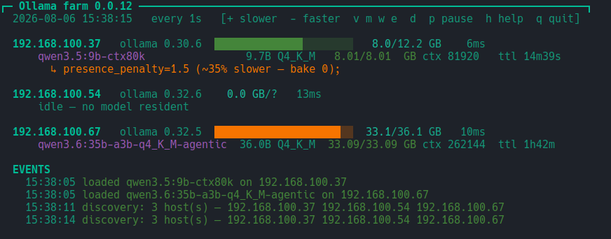

# ollamaFarm

**A btop-style live monitor for a small farm of [Ollama](https://ollama.com) servers —
one that watches for the silent ways a local LLM box loses most of its speed.**

[](https://www.gnu.org/software/bash/)
[](LICENSE)
[](https://www.shellcheck.net/)

One file, no runtime, no daemon: `curl` + `jq` + `awk` and a terminal.



<sub>Three hosts, one of them found by discovery (`.54`, with no known VRAM ceiling, so
`?`). `.37` is flagged for `presence_penalty`. Captured from v0.0.12.</sub>

`ollama ps` tells you what is loaded. This tells you what is *going wrong* — because
on this hardware the expensive mistakes are all silent: nothing errors, nothing warns,
the model answers correctly, and you simply lose a factor of 5 to 7 in throughput.
Every check below exists because it was measured costing real time on real hardware
(see [Where the numbers come from](#where-the-numbers-come-from)).

**Author:** Marcel Petrick &lt;mail@marcelpetrick.it&gt;
**License:** GPLv3 or later — see [LICENSE](LICENSE).
**Note:** this project was generated with AI assistance.

---

## What it watches

| # | Failure mode | Detected by | Measured cost |
|---|---|---|---|
| 1 | **Eviction thrash** — a second model displaces the resident one | diffing the model set between polls | **~70 s reload** per eviction |
| 2 | **Split placement** — part of the model sits in system RAM | `size_vram < size` | **5.3×** slower |
| 3 | **No baked `num_ctx`** | `/api/show` has no `num_ctx` | **16k** context cap; tool calling dies past it, silently |
| 4 | **`presence_penalty != 0`** | `/api/show` parameters | **~35%** of throughput |

Numbers 3 and 4 cannot be seen from `ollama ps` at all, and number 1 cannot be seen
from a *snapshot* of any kind — only a diff across time reveals it.

---

## At runtime

Real output, both servers busy, 104-column terminal:

```
┌─ Ollama farm 0.0.24 ───────────────────────────────────────────────────────────────────────┐
  2026-08-06 15:36:49   every 1s   [+ slower  - faster  v m w e  d  p pause  h help  q quit]

  192.168.100.37   ollama 0.30.6  ██████████████░░░░░░░░   8.0/12.2 GB    6ms
      qwen3.5:9b-ctx80k                9.7B Q4_K_M   8.01/8.01  GB ctx 81920   ttl 16m5s
        ↳ presence_penalty=1.5 (~35% slower — bake 0);

  192.168.100.67   ollama 0.32.5  ████████████████████░░  33.1/36.1 GB    6ms
      qwen3.6:35b-a3b-q4_K_M-agentic  36.0B Q4_K_M  33.09/33.09 GB ctx 262144  ttl 1h44m

  EVENTS
    15:36:49 loaded qwen3.5:9b-ctx80k on 192.168.100.37
```

Note the `↳` line: `.37`'s model is running the qwen vendor default
`presence_penalty 1.5` and is giving away about a third of its speed for nothing.
`.67`'s is a purpose-built variant and is clean.

### And when things go wrong

The following frame is **fabricated** to show the alarm states together — the hosts
`.13`/`.99`, the model names and the numbers in it are invented, not measurements.
Every other example in this file is real captured output.

```
┌─ Ollama farm 0.0.24 ──────────────────────────────────────────────────   PAUSED — press p to resume ┐
  2026-08-13 03:04:59   every 5s   [+ slower  - faster  v m w e  d  p pause  h help  q quit]

  192.168.100.13   ollama 0.32.5  ██████████████████████  35.9/36.1 GB  1840ms
      hoarder-70b:q8_0                69.9B Q8_0    31.40/35.80 GB ctx 4096    ttl 12s   ⚠ SPLIT→CPU (5.3x slower)
        ↳ presence_penalty=1.5 (~35% slower — bake 0); no baked num_ctx (16k cap via /v1/messages, tool calls die past it)
      tiny-yolk:0.5b                   0.5B Q4_0     0.41/0.41  GB ctx 2048    ttl 4m2s

  192.168.100.99   ollama 0.30.6  ░░░░░░░░░░░░░░░░░░░░░░   0.0 GB/?      9ms
      idle — no model resident

  192.168.100.37   ollama 0.30.6  UNREACHABLE (USB ethernet adapter up?)

  EVENTS
    03:04:31 loaded hoarder-70b:q8_0 on 192.168.100.13
    03:04:44 tiny-yolk:0.5b vanished on 192.168.100.13, 238s ttl left — suspected eviction, watching
    03:04:52 EVICTED tiny-yolk:0.5b on 192.168.100.13 → hoarder-70b:q8_0 after 8s (~70 s reload penalty)
    03:04:58 192.168.100.37 went unreachable (was holding: qwen3.5:9b-ctx80k)
```

Everything wrong with that box, top to bottom: the VRAM bar is red because it is at
99%; the 70B is **split to CPU** (31.40 resident of 35.80 total); it has **no baked
`num_ctx`**, so it is capped at 16k and its tool calls will silently stop; it has
`presence_penalty` on; its `ttl` is yellow because it expires in 12 s; latency is
1840 ms because the box is thrashing; a small model was **evicted** to make room; and
another host dropped off the network entirely. `.99` was found by discovery, so its
VRAM ceiling is honestly `?` rather than guessed.

---

## Keys

| key | effect |
|---|---|
| `-` / `+` | refresh **faster** / **slower** — steps the ladder `0.25 0.5 1 2 3 5 10 30` s |
| `p` | pause / resume (a paused frame polls nothing at all) |
| `v` | VRAM bars |
| `m` | per-model detail |
| `w` | the `↳` config warnings |
| `e` | event log |
| `d` | re-run host discovery |
| `t` | cycle colour theme (`dark` → `vivid` → `light`) |
| `s` | re-scan idle hosts for their VRAM ceiling |
| `h` or `?` | help overlay |
| `q` | quit |

`+` makes the interval *number* bigger, hence slower — the same direction as btop.
Any section you switch off is named in the header (`hidden: models:off(m)`), so a
toggle saved in an earlier session cannot leave you staring at a screen that looks
broken.

---

## Command line

```shell
./ollamaFarm.sh                    # default hosts, 1 s
./ollamaFarm.sh -n 5               # 5 s (snapped to the nearest ladder rung)
./ollamaFarm.sh -H 10.0.0.5,10.0.0.6
./ollamaFarm.sh -p 11435           # non-default port
./ollamaFarm.sh -D                 # scan for hosts at startup
./ollamaFarm.sh --probe-vram HOST  # scan for a VRAM ceiling now, then exit
./ollamaFarm.sh --no-auto-scan     # do not bootstrap unknown ceilings
./ollamaFarm.sh --theme light      # dark (default) | vivid | light
./ollamaFarm.sh --no-color         # plain; NO_COLOR is honoured too
./ollamaFarm.sh --version          # print the version and exit
./ollamaFarm.sh --help
```

Requires `curl`, `jq`, `awk`. Checked at startup.

---

## Host discovery

**Hardcoded by default; scanning is opt-in.** Three sources, highest precedence first:

1. `-H a,b,c` — pins the list; never overridden
2. `$XDG_CONFIG_HOME/ollamafarm/hosts` — the cached result of a previous scan
3. the built-in defaults, `192.168.100.37` and `192.168.100.67`

A scan runs only on `-D` or the `d` key. It derives the `/24` from the hosts it
already knows, probes `/api/version` on `.1`–`.254` **64 at a time** with a 0.6 s
timeout, and caches what answered. Measured: both servers found, well under the
refresh interval.

Two deliberate limits:

- It only scans `/24`s **derived from hosts it already knows**. It will not find a
  server on an unrelated subnet — blind-scanning arbitrary ranges is not something a
  monitor should do unasked.
- **Usable VRAM is never probed automatically.** Establishing it means pushing `num_ctx` until the
  model spills, which loads models and disturbs a shared machine. Known ceilings are
  the `VRAM_TOTAL` table in the script; anything else displays `?` and gets no bar,
  rather than a fabricated total. There is no VRAM figure anywhere in the Ollama HTTP
  API — see [docs/vram-discovery.md](docs/vram-discovery.md) for the full probe of
  every endpoint and the plan for learning the ceiling passively instead.

To teach it a new host's ceiling, add a line to `VRAM_TOTAL` near the top of the
script:

```bash
declare -A VRAM_TOTAL=( [192.168.100.37]=12.2 [192.168.100.67]=36.1 )
```

---

## Themes

Three, cycled with `t` or chosen with `--theme`:

| theme | for | palette |
|---|---|---|
| `dark` *(default)* | any terminal, including a plain tty | ANSI 8-colour, so it inherits **your** palette |
| `vivid` | dark background, 256-colour | loud, btop-style: cyan structure, orange figures, orchid model names |
| `light` | light background | dark ends of each hue — forest green, brick red, burnt orange |

`vivid` paints seven distinct hues in a single frame where `dark` uses five, two of
which are only bold and dim. The difference is that it colours **secondary** text —
field labels, units, the Ollama version, latency — instead of dimming it, which is
what makes a dashboard look alive rather than grey.

### The slots a theme paints

Colour is assigned by role, never picked at the call site, so a theme cannot
accidentally repurpose a meaning:

| slot | role |
|---|---|
| `C_GRN` | healthy — resident, fully in VRAM |
| `C_YEL` | about to change — expiring `ttl`, elevated latency, hidden sections |
| `C_RED` | costing you throughput **now** — split to CPU, evicted, unreachable |
| `C_FIG` | figures — VRAM totals, latency |
| `C_MODEL` | model names |
| `C_HDR` | structure — the header rule, `EVENTS`, `KEYS` |
| `C_HOST` | host identity |
| `C_LBL` | labels and units — `ctx`, `ttl`, quantisation, version |
| `C_DIM` | genuinely secondary text |

The palette changes; **the meaning never does.** In every theme green is healthy, red
is costing you throughput right now, and yellow is about to change. That is the whole
point of colouring a monitor.

Two notes on the choices:

- `light` avoids yellow entirely — it is unreadable on white — and uses dark amber
  instead. It also sets an explicit grey for secondary text, because the ANSI *dim
  attribute* renders as barely-there on a light background in several terminals.
- `dark` deliberately stays 8-colour rather than looking nicer. It is the fallback
  that has to work over serial, in a VM console, and under `TERM=linux`, and its
  extra slots fall back to bold and dim rather than inventing hues.

`--no-color` and `NO_COLOR` bypass theming entirely and emit no escape sequences.

---

## VRAM ceilings

A bar needs a denominator, and the Ollama API does not expose one — there is no
total-VRAM field on any endpoint. Three sources are used instead, in descending order
of trust:

| shown as | source | meaning |
|---|---|---|
| `33.1/36.1 GB` | the `VRAM_TOTAL` table in the script | a figure someone measured and stands behind |
| `0.0/5.78+ GB` | **probed** with `s`, or **learned** passively | *at least* this much fits — a lower bound |
| `0.0 GB/?` | nothing known | no bar drawn, rather than a guessed one |

The **`+` is load-bearing.** A bar that silently meant either "this is the capacity" or
"it is at least this" would be worse than no bar.

**Learned** costs nothing: `/api/ps` is already polled every frame, so the largest
total ever seen *fully resident* is recorded as a lower bound. A split total is never
used — it can be lower than a residency already known to work.

**Scanning** gets a tighter figure by loading a model at escalating `num_ctx` until it
splits — which is also how a host with *nothing* resident gets bootstrapped, since
passive observation cannot start from an idle server. It happens three ways:

```shell
# automatic: on startup, for any idle host whose ceiling is unknown or only learned
./ollamaFarm.sh
./ollamaFarm.sh --no-auto-scan          # opt out

# interactive: press s at any time to re-scan
# foreground, no TUI — usable from a script:
./ollamaFarm.sh --probe-vram            # every known host
./ollamaFarm.sh --probe-vram 10.0.0.5   # one host
```

### `--probe-vram` in detail

Runs the scan in the foreground, prints progress, exits. Real output:

```console
$ ./ollamaFarm.sh --probe-vram 192.168.100.54
scan started 17:57:49
probe 192.168.100.54: llama3.2-vision:11b (max ctx 131072)
  llama3.2-vision:11b splits even at ctx 2048 — too large, trying a smaller model
probe 192.168.100.54: minicpm-v:latest (max ctx 32768)
  minicpm-v:latest splits even at ctx 2048 — too large, trying a smaller model
probe 192.168.100.54: qwen3.5:4b-ctx54k (max ctx 262144)
  ctx 2048: resident 3.06 GB
  ctx 132096: resident 7.22 GB
  ctx 197120: SPLIT — ceiling is below this
  ctx 164608: SPLIT — ceiling is below this
  ctx 148352: resident 7.77 GB
  ctx 156480: SPLIT — ceiling is below this
  ctx 152416: SPLIT — ceiling is below this
RESULT 192.168.100.54 7.77
scan finished 17:58:57
```

Note the two fallbacks: the largest model, and then the second largest, split even at
the minimum context, so the scan moved on to one that fits. That is the reach problem —
it wants the biggest model that still fits, and finds it by trying.

**The result is used, not just printed.** It is written to
`$XDG_CONFIG_HOME/ollamafarm/vram` as `source=probed`, and every later run of the
monitor draws its bar against it:

```
192.168.100.54   ollama 0.32.6  ░░░░░░░░░░░░░░░░░░░░░░   0.0/7.77+ GB    7ms
```

Exit codes:

| code | meaning |
|---|---|
| `0` | a ceiling was established and stored |
| `1` | none could be — every host busy, or no model fits |
| `2` | bad arguments |

So it is usable in a script:

```shell
./ollamaFarm.sh --probe-vram 10.0.0.5 || echo "host busy, try later"
```

Repeated runs are cheap to reason about: the figure only ever moves when the machine
does, and a probed value is never overwritten by a smaller passive observation.

It is safe on a shared server:

- **idle hosts only.** Anything resident and the host is skipped, loudly, naming what
  it would have had to evict. Evicting a colleague's model costs them a ~70 s reload.
- `keep_alive: 0` on every load, so nothing is left behind.
- it runs **detached** — the display keeps refreshing and progress appears in the
  event log. A second `s` while one is running is refused.

Measured durations: **~15 s** for a small box, and **several minutes** for a large one —
reach requires a large model, and a 33 GB model alone takes ~70 s per load. The result
is still a lower bound; see [docs/vram-discovery.md](docs/vram-discovery.md).

---

## Configuration

Interval and toggles persist to `$XDG_CONFIG_HOME/ollamafarm/config`
(`~/.config/ollamafarm/config`):

```
idx=2            # index into the interval ladder; 2 = 1 s
show_bars=1
show_models=1
show_warn=1
show_events=1
theme=dark
```

Only these keys are read back, and each is validated on load, so a corrupt or
hand-edited file cannot break a run. Delete the file to return to defaults.
The discovered host list lives beside it in `hosts`.

---

## Load on a shared server

`.67` is a colleague's machine, so the polling is deliberately cheap:

- two `GET`s per host per frame (`/api/version`, `/api/ps`) — both read-only
- `/api/show` is fetched **once per (host, model)** and cached; the parameters cannot
  change while a model is resident
- **nothing** is polled while paused
- the default 1 s can be dialled back to 30 s with `+`; at 1 Hz two hosts are about
  170k requests a day, which is worth knowing before leaving it running overnight

The monitor never loads, unloads, or creates a model.

---

## What it cannot show

**GPU temperature, utilisation, fan and power.** The Ollama HTTP API does not expose
them — it reports model residency only. Those counters live in `nvidia-smi` on the
server itself, so reading them would mean SSH access to every host.

That is deliberately out of scope. This tool talks to one HTTP API and needs no
credentials, no agent and no account on the machines it watches, which is what makes
it safe to point at a colleague's server. An earlier version shipped an `--ssh` flag
that was permanently inert because the key access never materialised; a feature that
never works is worse than an absent one, so it was removed.

**Whether a model is actively generating.** `/api/ps` reports residency, not activity.
The latency figure is the closest available proxy: a host busy generating answers
`/api/ps` more slowly, which is why it turns yellow above 400 ms and red above 1500 ms.

---

## Where the numbers come from

Every cost quoted above — `~70 s`, `5.3×`, `~35%`, the 16k cap — was measured, not
estimated, during a benchmarking exercise across two Ollama servers: a dual-GPU box
with 36.1 GB of usable VRAM (Ollama 0.32.5) and a 12.2 GB box (Ollama 0.30.6), over
13 model configurations of the qwen3.5/3.6 family.

| Claim | How it was established |
|---|---|
| eviction costs **~70 s** | loaded a 9 GB model beside a resident 33 GB MoE; the MoE was unloaded, and the next request took 70.2 s end to end |
| split placement costs **5.3×** | same weights, same quantisation, only `num_ctx` changed: 29.6 tok/s fully resident vs 5.6 tok/s with 4.58 GB of 36.65 GB pushed to system RAM |
| `presence_penalty` costs **~35%** | isolated at fixed weights, context and VRAM: 84.4 tok/s at the vendor default of 1.5, 129.5 tok/s at 0 |
| bare tags cap at **16384** | sent 4k/16k/32k/50k-token prompts through `/v1/messages`; processed counts pinned at 16386 past the cap, and `tool_use` blocks stopped appearing, with no error at any layer |

Two caveats stated honestly, because they bound how far these numbers travel:

- They are **specific to that hardware and those models.** The `~70 s` reload is what a
  33 GB MoE costs; a smaller model reloads faster. The eviction message quotes the
  figure it was calibrated against rather than computing a per-model estimate.
- The `num_ctx`-overflow behaviour behind the 16k finding turned out to be **version
  dependent**: on Ollama 0.32.5 an overflowing prompt is truncated to `num_ctx/2`,
  while 0.30.6 fills the window normally. Treat a newer Ollama as something to
  re-measure, not to assume is better.

The full write-up lives with the original benchmarking work in
[codingWithGPT](https://github.com/marcelpetrick/codingWithGPT) under
`ollamaClaudeCode_v1/` (`review2.md`, `evaluation.pdf`). This repository carries only
the monitor.

---

## Development

```shell
./localPipeline.sh          # syntax, shellcheck, docs and smoke checks + summary
./localPipeline.sh --help
```

The pipeline is self-contained and needs no network for its mandatory stages; the live
smoke test against a real server is optional and skipped when no host answers.

---

## Versioning

Semantic versioning, patch bumped on every commit. `VERSION` near the top of
`ollamaFarm.sh` is the single source of truth; it is rendered in the header
(`┌─ Ollama farm 0.0.24 ──…──┐`) so a screenshot or a pasted frame identifies its
build, and `--version` prints it.

**No git tags are used.** The version in the script is the only marker, so there is
exactly one place to look and nothing that can disagree with it.

While the major version is `0` the interface is not stable.

---

## License

GPLv3. See [LICENSE](LICENSE).

---

## Known limits

- The `~70 s` reload figure in the eviction message is the measured cost for the
  33 GB MoE on `.67`. A smaller model reloads faster; the message states the
  penalty it was calibrated against rather than computing a per-model estimate.
- Eviction confirmation uses a 150 s window. A displacement whose replacement takes
  longer than that to become resident stays labelled "suspected".
- Frames are clipped to the terminal height rather than scrolled. Enlarge the window
  or press `m`/`e` if you see `…frame clipped to terminal height`.
