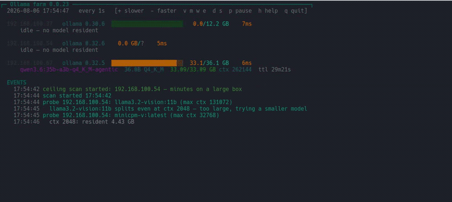
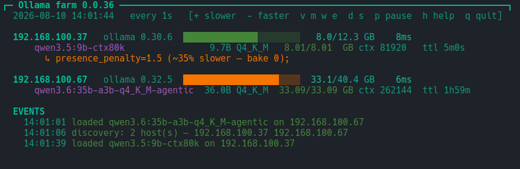

# ollamaFarm

**A terminal dashboard for a farm of [Ollama](https://ollama.com) servers.** Finds them
on your network, shows what each one has resident, and keeps up at 1 Hz — in the spirit
of `htop` and `btop`, for LLM boxes instead of CPUs.

[](https://github.com/marcelpetrick/ollamaFarm/actions/workflows/quality.yml)
[](https://github.com/marcelpetrick/ollamaFarm/actions/workflows/release.yml)
[](https://github.com/marcelpetrick/ollamaFarm/releases/latest)
[](https://www.gnu.org/software/bash/)
[](LICENSE)

One file, no runtime, no daemon, no agent on the servers: bash, `curl`, `jq`, `awk` and a
terminal.

[](media/showcase.webm)

<sub>Click the preview for the full-quality recording
([`media/showcase.webm`](media/showcase.webm), VP9, 38 s).</sub>



<sub>Two hosts after discovery; `.37` is flagged for `presence_penalty`. Captured from
v0.0.36.</sub>

**Author: Marcel Petrick <mail@marcelpetrick.it>**

**License: GPLv3 or later. See `LICENSE`.**

**Note: project is generated with AI.**

---

## Features

- **Finds your servers.** Start with `-D`, or press `d`, to scan each configured `/24`
  for anything answering the Ollama API and cache what it finds.
- **Shows every host at a glance** — version, VRAM in use with a bar, response latency,
  and each resident model with its size, quantisation, context and keep-alive countdown.
- **Measures usable VRAM**, which the API does not expose at all: it learns a floor from
  what it observes, and can scan an idle host by loading a model with every layer pinned
  to the GPU and raising the context until the card refuses — which reaches far closer
  to the real edge than watching for the model to spill. Automatic for unknown idle
  hosts, or on demand with `s` / `--probe-vram`.
- **A live event log** — models loading, expiring, being displaced, hosts dropping off
  the network. State changes you would otherwise have to catch in the act.
- **Three colour themes**, switchable while running: `dark` for any terminal, `vivid`
  for a loud 256-colour look, `light` for a white background.
- **Proper TUI controls** — `+`/`-` refresh rate, pause, per-section toggles, a help
  overlay, all persisted between sessions.
- **Credential-free monitoring.** The normal refresh loop only reads API state and
  needs no account on the machines it watches. A VRAM probe is the deliberate exception:
  it loads only on an idle host, unloads after each attempt, and can be disabled with
  `--no-auto-scan`.
- **Flags configurations that quietly cost you throughput** — see
  [what it watches](#what-it-watches).

---

## At runtime

Real output, two servers busy, 104-column terminal. Captured from v0.0.37, which predates
the `l` and `s` key hints and drew a hand-demonstrated ceiling without its `+`:

```
┌─ Ollama farm 0.0.37 ───────────────────────────────────────────────────────────────────────┐
  2026-08-06 15:36:49   every 1s   [+ slower  - faster  v m w e  d  p pause  h help  q quit]

  192.168.100.37   ollama 0.30.6  ██████████████░░░░░░░░   8.0/12.3 GB    6ms
      qwen3.5:9b-ctx80k                9.7B Q4_K_M   8.01/8.01  GB ctx 81920   ttl 16m5s
        ↳ presence_penalty=1.5 (~35% slower — bake 0);

  192.168.100.67   ollama 0.32.5  ██████████████████░░░░  33.1/40.4 GB    6ms
      qwen3.6:35b-a3b-q4_K_M-agentic  36.0B Q4_K_M  33.09/33.09 GB ctx 262144  ttl 1h44m

  EVENTS
    15:36:49 loaded qwen3.5:9b-ctx80k on 192.168.100.37
```

Each host line is `address · version · VRAM bar · used/ceiling · latency`, followed by
one line per resident model. The `↳` line under a model is a configuration warning; a
`+` after a ceiling means "at least this much" rather than a figure with a known upper
edge — see [VRAM ceilings](#vram-ceilings).

<details>
<summary>The same view with things going wrong (fabricated, to show the alarm states together)</summary>

```
┌─ Ollama farm 0.0.46 ──────────────────────────────────────────────────   PAUSED — press p to resume ┐
  2026-08-13 03:04:59   every 5s   [+ slower  - faster  v m w e  l history:10  d s  p pause  h help  q quit]

  192.168.100.13   ollama 0.32.5  ██████████████████████  35.9/36.1+ GB 1840ms
      hoarder-70b:q8_0                69.9B Q8_0    31.40/35.80 GB ctx 4096    ttl 12s   ⚠ SPLIT→CPU (5.3x slower)
        ↳ presence_penalty=1.5 (~35% slower — bake 0); no baked num_ctx (16k cap via /v1/messages, tool calls die past it)
      tiny-yolk:0.5b                   0.5B Q4_0     0.41/0.41  GB ctx 2048    ttl 4m2s

  192.168.100.99   ollama 0.30.6  ░░░░░░░░░░░░░░░░░░░░░░   0.0 GB/?      9ms
      idle — no model resident

  192.168.100.37   ollama 0.30.6  UNREACHABLE (USB ethernet adapter up?)

  EVENTS (last 10)
    03:04:31 loaded hoarder-70b:q8_0 on 192.168.100.13
    03:04:44 tiny-yolk:0.5b vanished on 192.168.100.13, 238s ttl left — suspected eviction, watching
    03:04:52 EVICTED tiny-yolk:0.5b on 192.168.100.13 → hoarder-70b:q8_0 after 8s (~70 s reload penalty)
    03:04:58 192.168.100.37 went unreachable (was holding: qwen3.5:9b-ctx80k)
```

Everything wrong with that box, top to bottom: the VRAM bar is red at 99%; the 70B is
**split to CPU** (31.40 GB resident of 35.80); it has **no baked `num_ctx`** so it is
capped at 16k and its tool calls will silently stop; `presence_penalty` is on; its
`ttl` is yellow because it expires in 12 s; latency is 1840 ms because the box is
thrashing; a small model was **evicted** to make room; and another host dropped off the
network. `.99` was found by discovery, so its ceiling is honestly `?` rather than
guessed.

</details>

---

## Keys

| key | effect |
|---|---|
| `-` / `+` | refresh **faster** / **slower** — steps the ladder `0.25 0.5 1 2 3 5 10 30` s |
| `p` | pause / resume (a paused frame polls nothing at all) |
| `v` | VRAM bars |
| `m` | per-model detail |
| `w` | the `↳` config warnings |
| `e` | event log |
| `l` | event history length — cycles `5` → `10` → `20` → `50` entries |
| `d` | re-run host discovery |
| `s` | re-scan idle hosts for their VRAM ceiling |
| `t` | cycle colour theme (`dark` → `vivid` → `light`) |
| `h` or `?` | help overlay |
| `q` | quit |

`+` makes the interval *number* bigger, hence slower — the same direction as btop. Any
section you switch off is named in the header (`hidden: models:off(m)`), so a toggle
saved in an earlier session cannot leave you staring at a screen that looks broken.

---

## Command line

```shell
./ollamaFarm.sh                    # default hosts, 1 s
./ollamaFarm.sh -n 5               # 5 s (snapped to the nearest ladder rung)
./ollamaFarm.sh -H 10.0.0.5,10.0.0.6
./ollamaFarm.sh -p 11435           # non-default port
./ollamaFarm.sh -D                 # scan for hosts at startup
./ollamaFarm.sh --probe-vram HOST  # measure a VRAM ceiling now, then exit
./ollamaFarm.sh --no-auto-scan     # do not bootstrap unknown ceilings
./ollamaFarm.sh --theme light      # dark (default) | vivid | light
./ollamaFarm.sh --no-color         # plain; NO_COLOR is honoured too
./ollamaFarm.sh --version
./ollamaFarm.sh --help
```

Requires **bash 4.0+**, **jq 1.5+**, GNU `date` (coreutils), `curl` and `awk`; scanning
also needs `setsid` and `nohup`. All checked at startup, and these are minimums for
features the script actually uses, not pins. bash 3.2 (macOS's `/bin/bash`), jq 1.4 and
busybox `date` are refused with a message; bash 4.0.44 with jq 1.5 was tested end to end.

---

## Host discovery

**Hardcoded defaults; scanning is opt-in.** Three sources, highest precedence first:

1. `-H a,b,c` — pins the list; never overridden
2. `$XDG_CONFIG_HOME/ollamafarm/hosts` — the cached result of a previous scan
3. the built-in defaults

A scan runs on `-D` or the `d` key. It derives the `/24` from the hosts it already
knows, probes `/api/version` on `.1`–`.254` **64 at a time** with a 0.6 s timeout, and
caches what answered — both servers found well inside one refresh interval.

Two deliberate limits: it only scans `/24`s **derived from hosts it already knows**, so
it will not find a server on an unrelated subnet (blind-scanning arbitrary ranges is not
something a monitor should do unasked); and whether an address is public or private is
irrelevant, only its numeric range matters. A loopback-only server is therefore never
auto-discovered — use `-H 127.0.0.1`.

To seed a host with a footprint you have already demonstrated fully resident, add it to
`VRAM_FLOOR` near the top of the script. Such a host is not auto-scanned:

```bash
declare -A VRAM_FLOOR=( [192.168.100.37]=12.3 [192.168.100.67]=40.4 )
```

---

## Themes

Three, cycled with `t` or chosen with `--theme`:

| theme | for | palette |
|---|---|---|
| `dark` *(default)* | any terminal, including a plain tty | ANSI 8-colour, so it inherits **your** palette |
| `vivid` | dark background, 256-colour | loud: cyan structure, orange figures, orchid model names |
| `light` | light background | dark ends of each hue — forest green, brick red, blue figures |

`vivid` paints seven distinct hues in a single frame where `dark` uses five, two of
which are only bold and dim. The difference is that it colours **secondary** text —
field labels, units, the version, latency — instead of dimming it.

Colour is assigned by role, never picked at the call site, so a theme repaints meanings
but cannot repurpose them: **green is healthy, yellow is about to change, red is costing
you throughput right now** — in every theme.

<details>
<summary>The slots a theme paints, and two notes on the choices</summary>

| slot | role |
|---|---|
| `C_GRN` | healthy — resident, fully in VRAM |
| `C_YEL` | about to change — expiring `ttl`, elevated latency, hidden sections |
| `C_RED` | costing you throughput **now** — split to CPU, evicted, unreachable |
| `C_FIG` | figures — VRAM totals, latency |
| `C_MODEL` | model names |
| `C_HDR` | structure — the header rule, `EVENTS`, `KEYS` |
| `C_HOST` | host identity |
| `C_LBL` | labels and units — `ctx`, `ttl`, quantisation, version |
| `C_DIM` | genuinely secondary text |

- `light` avoids yellow entirely — it is unreadable on white — and uses dark amber. It
  also sets an explicit grey for secondary text, because the ANSI *dim attribute*
  renders as barely-there on a light background in several terminals.
- `dark` deliberately stays 8-colour rather than looking nicer. It is the fallback that
  has to work over serial, in a VM console, and under `TERM=linux`.

</details>

`--no-color` and `NO_COLOR` bypass theming entirely and emit no escape sequences.

---

## VRAM ceilings

A bar needs a denominator, and the Ollama API does not expose one — there is no
total-VRAM field on any endpoint. Three sources are used instead:

| shown as | source | meaning |
|---|---|---|
| `33.1/40.4+ GB` | the `VRAM_FLOOR` table, a **probe**, or **learned** | *at least* this much fits — a lower bound |
| `0.0 GB/?` | nothing known | no bar drawn, rather than a guessed one |

Every source is a footprint that was *demonstrated* to fit, so every figure is a lower
bound, and the largest one available is drawn. The **`+` is load-bearing.** A bar that
silently meant either "this is the capacity" or "it is at least this much" would be worse
than no bar. Until 0.0.46 the hand-entered table was shown without the `+`, and always won
over a larger observation; both were wrong for the same reason.

**Learned** costs nothing: `/api/ps` is already polled every frame, so the largest total
ever seen *fully resident* is recorded. **Scanning** gets a far tighter figure, and is
also how a host with nothing resident gets bootstrapped, since passive observation
cannot start from an idle server:

```shell
# automatic on startup, for any idle host whose ceiling is unknown or only learned
./ollamaFarm.sh
./ollamaFarm.sh --no-auto-scan          # opt out

# press s at any time to re-scan; or, in the foreground with no TUI:
./ollamaFarm.sh --probe-vram            # every known host
./ollamaFarm.sh --probe-vram 10.0.0.5   # one host
```

### Why the scan pins the layer count

Every test load sends `num_gpu: 999`, and that one option is the difference between a
guess and a measurement.

Left to itself, Ollama decides how many layers to offload from its own pre-flight
estimate, and that estimate is deliberately cautious: it holds a reserve, it can only
move whole layers, and it would far rather split into system RAM than risk an
allocation failure. So the largest footprint Ollama will *voluntarily* place is well
short of what the card actually holds. Watching for the split therefore measures
**Ollama's caution, not the GPU** — on the dual-GPU box here it stopped at 36.1 GB.

Pinning the layer count takes the estimate out of the loop and lets the CUDA allocator
answer directly: a load that succeeds proves those bytes fit, and a load refused with
`cudaMalloc failed: out of memory` proves that configuration does not. The search runs
between the two. Re-measured that way the same box reaches **40.4 GB** — 11% more than
the old method could ever report, and 4.3 GB of headroom that was being drawn as full.

A refused load is contained in the `llama-server` subprocess; the Ollama daemon itself
is unaffected and keeps serving.

### Why the result still carries a `+`

A refusal is tempting to read as *the* ceiling — the card said no, after all. It is not,
and this cost us a wrong label before it was caught. **A refusal bounds the model being
loaded, not the machine.** Measured on the dual-GPU host, both runs idle, minutes apart:

| model | largest fully-resident footprint |
|---|---|
| `qwen3.6:27b-q8_0` | **40.47 GB** |
| `qwen3.6:27b-mtp-q8_0-ctx60k` | **34.69 GB** |

Same box, same day, 5.8 GB apart. A model's layers divide unevenly across two cards, so
one fills while the other still has room, and where that wall sits is a property of the
model rather than of the hardware. The scan reports whichever model it happened to pick,
which is why every scanned figure stays a lower bound and keeps its `+` — and why a
*larger* passive observation is allowed to replace it without argument.

### Safety

**Idle hosts only** — anything resident and the host is skipped, loudly, naming what it
would have had to evict, and the check is repeated before **every** test load, so a host
that someone starts using mid-scan stops the scan rather than losing their model; an explicit `keep_alive: 0` request unloads the model after
every test load; and it runs **detached**, so the display keeps refreshing while
progress appears in the event log. A second scan while one runs is refused.

Durations, measured: **103 s** on the 12 GB box, most of it rejecting seven models too
large to place (the run below), and **~3 min** on the dual-GPU box — reach needs a large
model, and a 33 GB model alone takes ~70 s per load.

<details>
<summary><code>--probe-vram</code> in detail: real output, exit codes, scripting</summary>

```console
$ ./ollamaFarm.sh --probe-vram 192.168.100.37
scan started 12:16:14
probe 192.168.100.37: qwen2.5-coder:32b (max ctx 32768)
  qwen2.5-coder:32b will not fit even at ctx 2048 — trying a smaller model
probe 192.168.100.37: qwen3-coder:30b (max ctx 262144)
  qwen3-coder:30b will not fit even at ctx 2048 — trying a smaller model
… five more too large to place, elided …
probe 192.168.100.37: qwen3:8b-q8_0 (max ctx 40960)
  ctx 2048: resident 8.59 GB
  ctx 21504: resident 11.48 GB
  ctx 31232: OUT OF MEMORY — the ceiling is below this
  ctx 26368: resident 12.20 GB
  ctx 28800: OUT OF MEMORY — the ceiling is below this
RESULT 192.168.100.37 12.20 probed
  (the GPU refused more of this model)
scan finished 12:17:57
```

Two things are happening there. The **fallback chain**: seven models in a row could not
be placed on a 12 GB card, so the scan kept stepping down until one fitted. That is the
reach problem — it wants the biggest model that still fits, and finds it by trying, and
a rejection is cheap because the allocator refuses before any weights move.

Then the **search**: 26368 fitted at 12.20 GB and 28800 did not, so the scan stopped
there. The parenthesised line says *why* it stopped — at a refusal from the card, rather
than at the end of the model's context range — which is useful to know and, per the
section above, still not a statement about the machine.

**The result is used, not just printed.** It is written to
`$XDG_CONFIG_HOME/ollamafarm/vram` as `source=probed`, and every later run draws its bar
against it:

```
192.168.100.37   ollama 0.30.6  ░░░░░░░░░░░░░░░░░░░░░░   0.0/12.20+ GB    7ms
```

| exit code | meaning |
|---|---|
| `0` | a ceiling was established and stored |
| `1` | none could be — every host busy, or no model fits |
| `2` | bad arguments |

```shell
./ollamaFarm.sh --probe-vram 10.0.0.5 || echo "host busy, try later"
```

A stored value is never lowered — not by a smaller passive observation, and not by a
later scan that happened to pick a less favourable model. A *larger* one does replace it,
and that is expected rather than alarming: the scan reached only as far
as one model could take it, and real traffic may run a model that divides across the
cards better. Both are lower bounds, so the larger simply wins.

</details>

Full investigation of what the API can and cannot tell you, including the wrong turns:
[docs/vram-discovery.md](docs/vram-discovery.md). How the pieces fit together, in C4
diagrams: [docs/architecture.md](docs/architecture.md).

---

## Configuration

Interval, toggles, event history length and theme persist to `$XDG_CONFIG_HOME/ollamafarm/config`
(`~/.config/ollamafarm/config`):

```
idx=2            # index into the interval ladder; 2 = 1 s
show_bars=1
show_models=1
show_warn=1
show_events=1
event_max=10     # cycled by l: 5, 10, 20 or 50 retained entries
theme=dark
```

Only these keys are read back, and each is validated on load, so a corrupt or
hand-edited file cannot break a run. Delete the file to return to defaults. The
discovered host list and learned ceilings live beside it in `hosts` and `vram`.

---

## What it watches

Beyond showing state, it flags four configurations that cost real throughput and report
no error anywhere:

| flagged | detected by | measured cost |
|---|---|---|
| **Eviction thrash** — a second model displaces the resident one | diffing the model set between polls | **~70 s** reload |
| **Split placement** — part of the model sits in system RAM | `size_vram < size` | **5.3×** slower |
| **No baked `num_ctx`** | `/api/show` | **16k** context cap; tool calling then stops silently |
| **`presence_penalty != 0`** | `/api/show` | **~35%** of throughput |

The last two are invisible to `ollama ps`, and the first cannot be seen in a snapshot of
any kind — only a diff across time reveals it.

<details>
<summary>Where those numbers come from</summary>

Measured, not estimated, across two servers — a dual-GPU box with at least 40.4 GB
demonstrated fully resident (Ollama 0.32.5 at the time) and a 12 GB box (0.30.6) — over
13 model configurations of the qwen3.5/3.6 family.

| claim | how it was established |
|---|---|
| eviction costs **~70 s** | loaded a 9 GB model beside a resident 33 GB MoE; the MoE was unloaded, and the next request took 70.2 s end to end |
| split placement costs **5.3×** | same weights and quantisation, only `num_ctx` changed: 29.6 tok/s fully resident vs 5.6 tok/s with 4.58 GB of 36.65 GB in system RAM |
| `presence_penalty` costs **~35%** | isolated at fixed weights, context and VRAM: 84.4 tok/s at the vendor default of 1.5, 129.5 tok/s at 0 |
| bare tags cap at **16384** | sent 4k/16k/32k/50k-token prompts through `/v1/messages`; processed counts pinned at 16386 past the cap and `tool_use` blocks stopped appearing, with no error at any layer |

Two caveats, because they bound how far the numbers travel: they are **specific to that
hardware and those models** — the `~70 s` reload is what a 33 GB MoE costs, and the
eviction message quotes the figure it was calibrated against rather than computing a
per-model estimate; and the `num_ctx`-overflow behaviour behind the 16k finding is
**version dependent** — 0.32.5 truncates an overflowing prompt to `num_ctx/2` while
0.30.6 fills the window normally, so treat a newer Ollama as something to re-measure.

The full write-up lives with the original benchmarking work in
[codingWithGPT](https://github.com/marcelpetrick/codingWithGPT) under
`ollamaClaudeCode_v1/`. This repository carries only the monitor.

</details>

---

## Notes and limits

<details>
<summary>Load on a shared server, what it cannot show, known limits</summary>

**Load.** The monitoring loop makes two read-only `GET`s per host per frame
(`/api/version`, `/api/ps`); `/api/show` is fetched once per (host, model) and cached.
The loop polls nothing while paused, although a detached VRAM probe already in progress
continues until it finishes. At 1 Hz that is up to 2 × 86,400 ≈ 173k requests per host
per day — about 346k for two hosts; slightly fewer in practice, since a frame takes a
little longer than its interval. Worth knowing before leaving it running overnight; `+`
dials the interval back to 30 s.

**GPU temperature, utilisation, fan and power are not shown.** The Ollama API does not
expose them — they live in `nvidia-smi` on the server, which would mean SSH access to
every host. That is deliberately out of scope: needing no credentials is what makes this
safe to point at someone else's machine. An earlier version shipped an `--ssh` flag that
was permanently inert because the key access never materialised; a feature that never
works is worse than an absent one, so it was removed.

**Whether a model is actively generating** is not exposed either. `/api/ps` reports
residency, not activity. Latency is the closest proxy — a busy host answers `/api/ps`
more slowly, which is why it turns yellow above 400 ms and red above 1500 ms.

**Eviction confirmation** uses a 150 s window; a displacement whose replacement takes
longer to become resident stays labelled "suspected".

**Frames are clipped to the terminal height** rather than scrolled. Enlarge the window,
or press `m` / `e`, if you see `…frame clipped to terminal height`.

</details>

---

## Development

```shell
./localPipeline.sh          # syntax, shellcheck, docs and smoke checks + summary
./localPipeline.sh --help
```

The pipeline is self-contained and needs no network for its mandatory stages; the live
smoke test against a real server is optional and skipped when no host answers. Every
push to `master`, pull request against `master`, and manual dispatch runs the mandatory
stages in GitHub Actions. The Quality badge at the top links to the latest `master`
result. The workflow shallow-fetches the exact triggering ref, verifies its commit SHA,
and uses the pinned Ubuntu 26.04 runner's installed tools directly, so it depends on no
downloadable actions.

Maintainers can run the Release workflow manually from `master`. It reruns the quality
gate, reads the version from `ollamaFarm.sh`, creates the corresponding `vN.N.N` tag,
and publishes a normal (non-draft, non-prerelease) GitHub release. The standalone script
and its SHA-256 checksum are attached; GitHub's source archives contain the complete
repository. Release notes are built from commit subjects since the previous release.

Contributor and agent guidance, including the traps this codebase has already been
bitten by: [AGENTS.md](AGENTS.md).

---

## Versioning

Semantic versioning, patch bumped on every commit. `VERSION` near the top of
`ollamaFarm.sh` is the single source of truth; it is rendered in the header
(`┌─ Ollama farm 0.0.52 ──…──┐`) so a screenshot or a pasted frame identifies its build,
and `--version` prints it.

Release tags are created only by the manual Release workflow, after its quality gate.
The workflow derives `vN.N.N` from `VERSION` rather than accepting a second version
input, so the script remains the single source of truth.

While the major version is `0` the interface is not stable.
