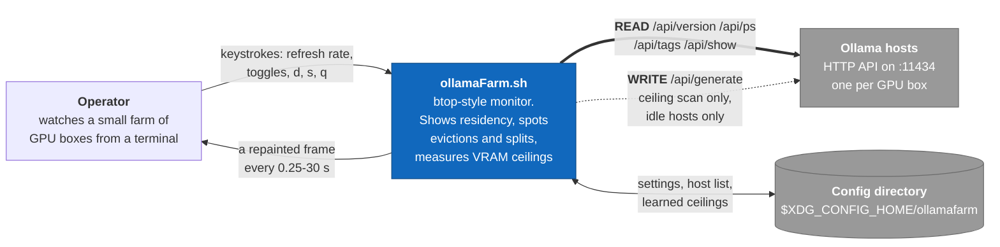
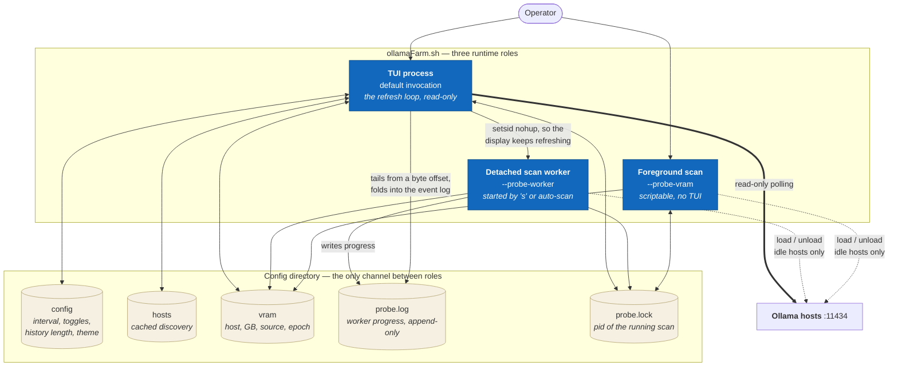
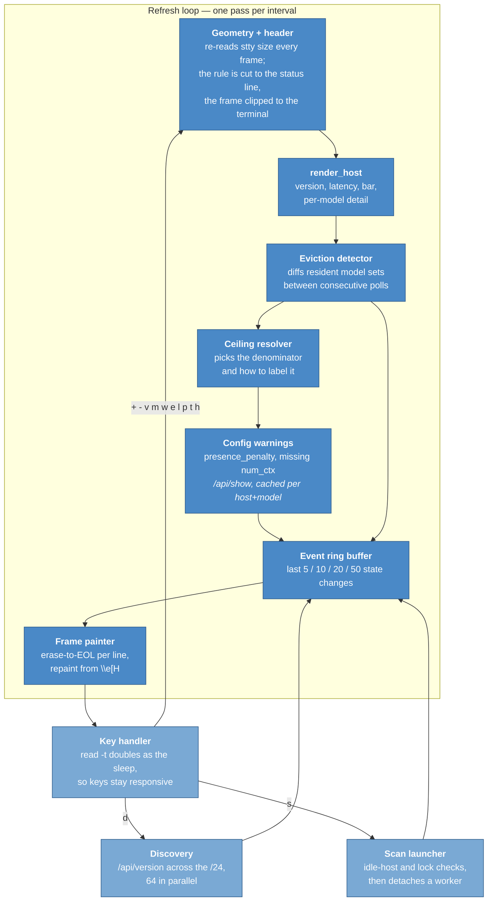
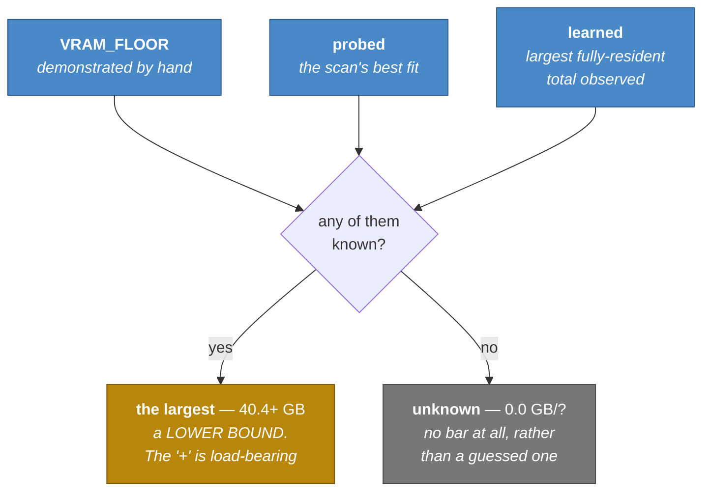
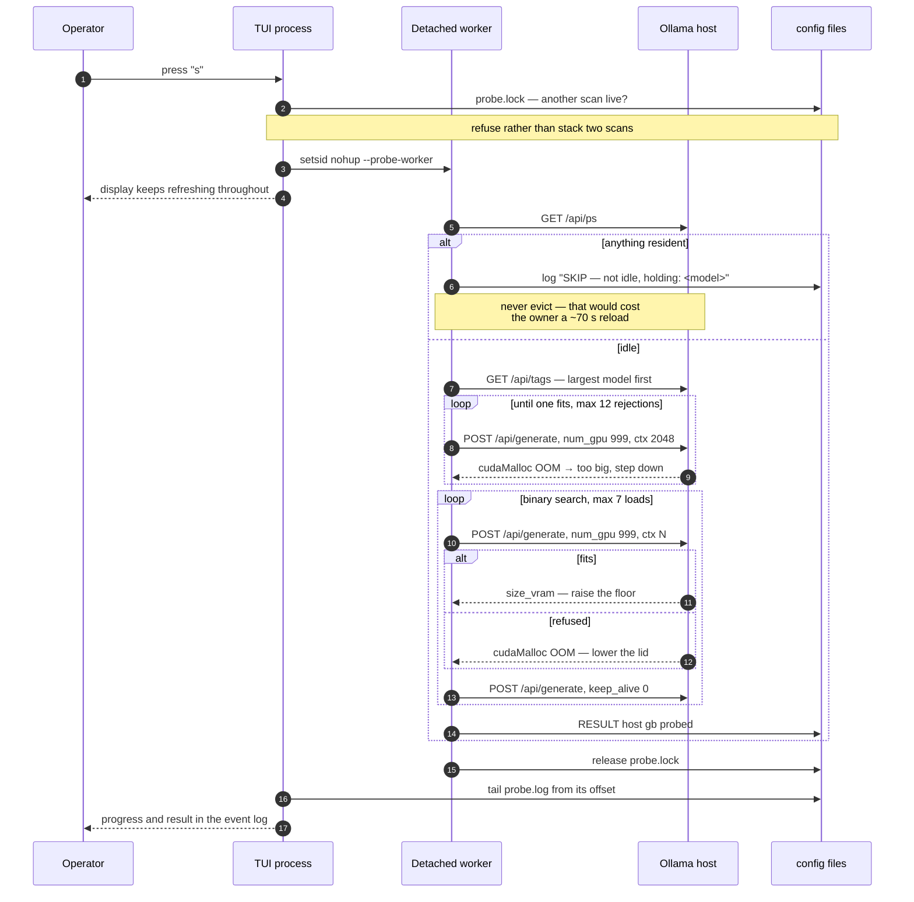

# Architecture

A [C4](https://c4model.com/) walk through `ollamaFarm.sh`, from the outside in. The
whole tool is two shell scripts and a config directory, so the interesting structure is
not in the file layout — it is in **which process talks to which server, and which of
those conversations are allowed to write**.

That distinction is the spine of the design: the refresh loop is strictly read-only and
needs no credentials, and exactly one feature departs from that, under rules spelled out
at every level below.

---

## Level 1 — System context

The dotted edge is the entire trust surface. Everything else only reads.

**Deliberately outside the system:** GPU temperature, utilisation, fan and power. They
live in `nvidia-smi`, reaching them would need SSH to every host, and needing no
credentials is what makes this safe to point at a colleague's machine. An earlier
`--ssh` flag was removed for being permanently inert.

---

## Level 2 — Containers

One file, but three distinct runtime roles, chosen by flag. They coordinate only through
files in the config directory — there is no socket and no shared memory.

Two details in that picture are load-bearing:

- **`probe.log` is read from a byte offset, not from the start.** Replaying it from zero
  made a previous session's scan reappear as if live, and re-adopted its `RESULT` lines,
  resurrecting a ceiling the user had just deleted. The offset is initialised to the
  log's current end at startup, so only output produced after this process started is
  ever read.
- **`probe.lock` holds a pid, not a flag.** A crashed scan leaves the file behind, so
  liveness is tested with `kill -0` rather than existence, and a stale lock self-heals.
  All three roles take it, so a foreground `--probe-vram` cannot be run alongside a TUI
  scan of the same GPU.

---

## Level 3 — Components inside the TUI process

`render_host` runs **in the current shell**, never in `$(...)`. It mutates the eviction
detector's state and the `/api/show` cache; a subshell would silently discard both, so
the detector would never fire and the cache would re-query a shared server every poll.
Frames are assembled into a string with `printf -v` for the same reason.

### The ceiling resolver

The denominator of the VRAM bar comes from three sources. Every one of them is a
footprint that was demonstrated to fit, so the largest wins and every figure carries a
`+`. How the figure is labelled is the most carefully guarded decision in the tool.

A bar that silently meant either "this is the capacity" or "it is at least this much"
would be worse than no bar.

**A scan does not escape the `+`.** An out-of-memory refusal looks like the upper bound
that would justify dropping it, and briefly was treated as one. It is not: a refusal
bounds the model being loaded, not the machine. On the dual-GPU host,
`qwen3.6:27b-q8_0` reaches 40.47 GB and `qwen3.6:27b-mtp-q8_0-ctx60k` stops at
34.69 GB — same box, same day. Layers divide unevenly across two cards, so one fills
while the other still has room. Full reasoning in
[vram-discovery.md](vram-discovery.md).

---

## Dynamic view — a ceiling scan

The one flow that writes to a server, and therefore the one with rules at every step.

Steps 1-4 are the safety envelope; the two loops are the measurement. `keep_alive: 0`
after **every** test load is what keeps the host as idle as it was found.

### Why `num_gpu: 999`

Left to itself Ollama picks the layer count from its own pre-flight estimate, which
deliberately keeps a reserve and can only move whole layers — so watching for the moment
a model splits measures *Ollama's caution, not the GPU*. Pinning the layer count takes
the estimate out of the loop and lets the CUDA allocator answer directly, which reaches
far closer to the real edge of the card.

On the dual-GPU host here that was the difference between a reported 36.1 GB and a
demonstrated 40.4 GB. It does not make the figure exact — see the note under the ceiling
resolver above. Measurements in [vram-discovery.md](vram-discovery.md).

---

## Quality gate

`localPipeline.sh` is the same entry point CI runs, so a green local run means a green
build. Ten stages: tooling, `bash -n`, shellcheck, exec bits, documentation,
**doc/code agreement**, help and argument handling, config robustness, an offline render
smoke test, and an optional live one.

The doc/code agreement stage is the unusual one — it fails the build when the README
documents a flag the parser does not have, when the interval ladder in the prose has
drifted from the array, or when `VERSION` disagrees with `--version`. It has caught real
drift, which is why it is mandatory rather than a lint.
